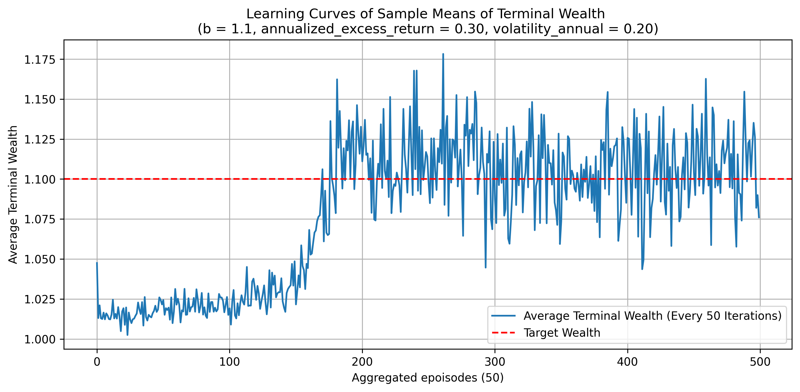
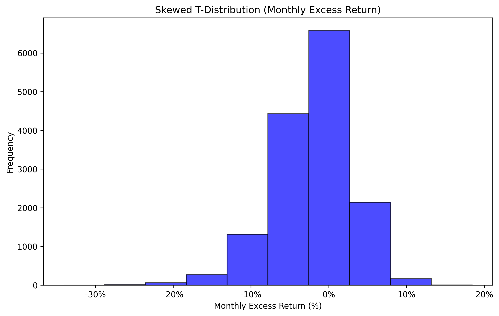

# Discrete-Time Exploratory-MV Algorithm

Here is a code in order to replicate experiments made in the article *["Discrete-Time Mean-Variance Strategy Based on Reinforcement Learning"]*. It was made for group learning.
  ["Discrete-Time Mean-Variance Strategy Based on Reinforcement Learning"]: https://arxiv.org/pdf/2312.15385
<figure markdown="span">
  { width=auto }
</figure>

<!-- more -->

__This tutorial was created for group learning.__

## 1. Requirement

python >= 3.9

``` py title="main.py"
import numpy as np
import matplotlib.pyplot as plt
from skewt_scipy.skewt import skewt
```

## 2. Value function
Value function parametrized by $\theta$

\[J^{\theta}(t, x ; w)=\theta_{1}^{T-t}\left(x-\rho_{t} w\right)^{2}+\theta_{2} t^{2}+\theta_{3} t+\theta_{4}, \]

``` py title="main.py"
def J_theta(theta_1, theta_2, theta_3, theta_4, w, T, x_t, t, rho_t):
    return (theta_1**(T-t)) * ((x_t - rho_t * w)**2) + \
        theta_2 * (t**2) + theta_3 * t + theta_4
```

## 3. Update parameter

First, we need to calculate the gradient of $C(\theta,\phi)$.

* Gradient of $C(\theta,\phi)$ in $\theta$.  

\[
    \frac{\partial C}{\partial \theta_{2}}=\sum_{\left(t, x_{t}\right) \in D}\left[\hat{J}^{\theta}\left(t, x_{t} ; w\right)-\lambda\left(\phi_{1}+\phi_{2}(T-t-1)\right)\right]\left((t+1)^{2}-t^{2}\right),
\]

\[
    \frac{\partial C}{\partial \theta_{3}}=\sum_{\left(t, x_{t}\right) \in D}\left[\hat{J}^{\theta}\left(t, x_{t} ; w\right)-\lambda\left(\phi_{1}+\phi_{2}(T-t-1)\right)\right],
\]

``` py title="main.py"
def grad_theta(theta_1, theta_2, theta_3, theta_4, w, T, lamb, phi_1, phi_2,
               vec_xi, vec_xi1, vec_ti, vec_ti1, rho_ti, rho_ti1):
    
    grad_theta_2 = ((((J_theta(theta_1, theta_2, theta_3, theta_4, w, T, vec_xi1, vec_ti1, rho_ti1) - J_theta(theta_1, theta_2, theta_3, theta_4, w, T, vec_xi, vec_ti, rho_ti))) - lamb *(phi_1 + phi_2*(T - vec_ti - 1)))*(vec_ti1**2 - vec_ti**2)).sum()
    grad_theta_3 = ((((J_theta(theta_1, theta_2, theta_3, theta_4, w, T, vec_xi1, vec_ti1, rho_ti1) - J_theta(theta_1, theta_2, theta_3, theta_4, w, T, vec_xi, vec_ti, rho_ti))) - lamb *(phi_1 + phi_2*(T - vec_ti - 1)))).sum()
    
    return grad_theta_2, grad_theta_3
```

* Gradient of $C(\theta,\phi)$ in $\phi$.  

\[
    \frac{\partial C}{\partial \phi_{1}}=-\lambda \sum_{\left(t, x_{t}\right) \in D}\left[\hat{J}^{\theta}\left(t, x_{t} ; w\right)-\lambda\left(\phi_{1}+\phi_{2}(T-t-1)\right)\right],
\]

\[
    \begin{split}
        \frac{\partial C}{\partial \phi_{2}}= &\sum_{\left(t, x_{t}\right) \in D}\left[\hat{J}^{\theta}\left(t, x_{t} ; w\right)-\lambda\left(\phi_{1}+\phi_{2}(T-t-1)\right)\right] \times \\
        & \left[2(T-t) e^{-2 \phi_{2}(T-t)}\left(x_{t}-\rho_{t} w\right)^{2}\right. \\
        & \left.-2(T-t-1) e^{-2 \phi_{2}(T-t-1)}\left(x_{t+1}-\rho_{t+1} w\right)^{2}-\lambda(T-t-1)\right].
    \end{split}
\]


``` py title="main.py"
def grad_phi(theta_1, theta_2, theta_3, theta_4, w, T, lamb, phi_1, phi_2,
               vec_xi, vec_xi1, vec_ti, vec_ti1, rho_ti, rho_ti1):

    grad_phi_1 = -lamb * ((J_theta(theta_1, theta_2, theta_3, theta_4, w, T, vec_xi1, vec_ti1, rho_ti1) - J_theta(theta_1, theta_2, theta_3, theta_4, w, T, vec_xi, vec_ti, rho_ti)) - lamb *(phi_1 + phi_2*(T - vec_ti - 1))).sum()
    
    frac1 = 2*((vec_xi -rho_ti*w)**2)*np.exp(-2*phi_2*(T-vec_ti))*(T-vec_ti)
    frac2 = 2*((vec_xi1-rho_ti1*w)**2)*np.exp(-2*phi_2*(T-vec_ti1))*(T-vec_ti1)

    first_term = ((J_theta(theta_1, theta_2, theta_3, theta_4, w, T, vec_xi1, vec_ti1, rho_ti1) - J_theta(theta_1, theta_2, theta_3, theta_4, w, T, vec_xi, vec_ti, rho_ti)) - lamb *(phi_1 + phi_2*(T - vec_ti - 1)))
    second_term = (frac1-frac2) - lamb*(T-vec_ti-1)

    grad_phi_2 = (first_term * second_term).sum()

    return grad_phi_1, grad_phi_2
```

Next, we need to update $(\theta_{2},\theta_{3})$ and $(\phi_{1},\phi_{2})$ according to the gradient.

The learning scheme for $\theta$ is as follows

\[
    \begin{split}
        &\theta \leftarrow \theta-\eta_{\theta} \nabla_{\theta} C(\theta, \phi) \\
        &\theta_1 \leftarrow e^{-2\phi_2} \\
        &\theta_4 \leftarrow -\theta_{2} T^{2}-\theta_{3} T-(w-b)^{2}
    \end{split}
\]

``` py title="main.py"
def update_theta(theta_1, theta_2, theta_3, theta_4, w, T, lamb, phi_1, phi_2, lr_theta, b,
                vec_xi, vec_xi1, vec_ti, vec_ti1, rho_ti, rho_ti1):
    
    grad_theta_2, grad_theta_3 = grad_theta(theta_1, theta_2, theta_3, theta_4, w, T, lamb, phi_1, phi_2, vec_xi, vec_xi1, vec_ti, vec_ti1, rho_ti, rho_ti1)

    theta_2 = theta_2 - (lr_theta*grad_theta_2)
    theta_3 = theta_3 - (lr_theta*grad_theta_3)

    theta_1 = np.exp(-2 * phi_2)
    theta_4 = -(theta_2 * (T**2)) - theta_3 * T - (w-b)**2

    return theta_1, theta_2, theta_3, theta_4
```

The learning scheme for $\phi$ is as follows

\[
    \phi \leftarrow \phi-\eta_{\phi} \nabla_{\phi} C(\theta, \phi) 
\]

``` py title="main.py"
def update_phi(theta_1, theta_2, theta_3, theta_4, w, T, lamb, phi_1, phi_2, lr_phi,
               vec_xi, vec_xi1, vec_ti, vec_ti1, rho_ti, rho_ti1):
    
    grad_phi_1, grad_phi_2 = grad_phi(theta_1, theta_2, theta_3, theta_4, w, T, lamb, phi_1, phi_2, vec_xi, vec_xi1, vec_ti, vec_ti1, rho_ti, rho_ti1)
    
    phi_1 = phi_1 - (lr_phi*grad_phi_1)
    phi_2 = phi_2 - (lr_phi*grad_phi_2)

    phi_2 = np.max([phi_2, 0.0000000001])

    return phi_1, phi_2
``` 

## 4. Discrete-Time Exploratory-MV Algorithm
``` py title="main.py"
def EMV(annualized_excess_return = 0.30, 
        volatility_annual = 0.20, 
        alpha = 0.05, 
        eta_theta = 0.0005, 
        eta_phi = 0.0005, 
        x0 = 1.0, 
        b = 1.1, 
        T = 3, 
        lambda_param = 2, 
        M = 20000, 
        N = 10,
        annualized_rf = 0.02,
        ):
    '''
    annualized_excess_return (float):
        Mean returns of the market
    volatility_annual (float):
        Mean std of the market
    alpha (float):
        Learning rate of the Lagrangian
    eta_theta (float):
        Learning rate of theta
    eta_phi (float):
        Learning rate of phi
    x0 (float):
        Initial value of the portfolio
    b (float):
        Targeted value at time T
    T (int):
        Horizon.
    lambda_param (float):
        Initial value of lambda (exploring parameter). Here, it is constant.
    M (int):
        Number of iterations of algorithm.
    N (int):
        Number of observation for updating Lagrangian
    annualized_rf (float):
        risk-free
    '''

    # Simulation study parameter

    # Distribution of market excess returns
    # skewed t distribution
    monthly_excess_return = (1 + annualized_excess_return)**(1/12) - 1
    volatility_monthly = volatility_annual / np.sqrt(12)
    degrees_of_freedom = 10                 
    skewness = -1.5                

    a = skewt.mean(skewness, degrees_of_freedom, monthly_excess_return, volatility_monthly)

    rf = (annualized_rf + 1)**(1/12)    # monthly risk-free return

    rho = []
    for t in range(T+1):
        rho.append(rf**(-(T-t)))

    # Initialization of parameters
    w = 3.0     # Lagrangian
    theta_2 = 1
    theta_3 = 0
    theta_4 = -theta_2 * T**2 - theta_3 * T - (w-b)**2

    phi_1 = 1
    phi_2 = 1
    theta_1 = np.exp(-2 * phi_2)

    terminal_wealths = []
    average_wealths = []
    theta_1_param = []
    theta_2_param = []
    theta_3_param = []
    theta_4_param = []
    phi_1_param = []
    phi_2_param = []
    w_param = []

    print('---------------Start---------------')
    print(f'b = {b}, a = {annualized_excess_return}, sigma = {volatility_annual} start')

    for k in range(M):
        # Sampling in skewed t distribution
        excess_returns = skewt.rvs(skewness, degrees_of_freedom, monthly_excess_return, volatility_monthly, T)

        X_calculated = [x0]
        t_calculated = [0]
        rho_calculated = [rho[0]]

        for i in range(T):
            ti  = i
            ti1 = i + 1
            rho_ti = rho[ti]
            rho_ti1 = rho[ti+1]
            rt  = excess_returns[i]
            xt = X_calculated[-1]

            insider = (rf**2 - np.exp(-2*phi_2 )) / (lambda_param * np.pi )
            mean_pi =  -np.sqrt(insider) * np.exp((2*phi_1 - 1) / 2) * (xt - rho[ti] * w)
            var_pi = (1/(2 * np.pi)) * np.exp( 2 * phi_2 * (T-ti-1) + 2 * phi_1 - 1 )

            if a < 0 :
                mean_pi = -mean_pi

            ut = np.random.normal(mean_pi, np.sqrt(var_pi))

            xt1 = rf * xt + ut * rt

            t_calculated.append(ti1)
            X_calculated.append(xt1) 
            rho_calculated.append(rho_ti1)

            vec_xi = np.array(X_calculated[:-1])
            vec_xi1 = np.array(X_calculated[1:])
            vec_ti = np.array(t_calculated[:-1])
            vec_ti1 = np.array(t_calculated[1:])
            vec_rho_ti = np.array(rho_calculated[:-1])
            vec_rho_ti1 = np.array(rho_calculated[1:])

            theta_1, theta_2, theta_3, theta_4 = update_theta(theta_1, theta_2, theta_3, theta_4, w, T, lambda_param, phi_1, phi_2, eta_theta, b,
                            vec_xi, vec_xi1, vec_ti, vec_ti1, vec_rho_ti, vec_rho_ti1)
            
            phi_1, phi_2 = update_phi(theta_1, theta_2, theta_3, theta_4, w, T, lambda_param, phi_1, phi_2, eta_phi,
                            vec_xi, vec_xi1, vec_ti, vec_ti1, vec_rho_ti, vec_rho_ti1)

        terminal_wealths.append(X_calculated[-1])

        # Update w
        if k % N == 0:
            w -= alpha * (np.mean(terminal_wealths[-N:]) - b)  # recent N terminal wealth values

        # Calculate average terminal wealth every 50 iterations
        if (k + 1) % 50 == 0:
            average_wealth = np.mean(terminal_wealths[-50:]) 
            average_wealths.append(average_wealth)
            
            theta_1_param.append(theta_1)
            theta_2_param.append(theta_2)
            theta_3_param.append(theta_3)
            theta_4_param.append(theta_4)
            phi_1_param.append(phi_1)
            phi_2_param.append(phi_2)
            w_param.append(w)
        
    fig, (ax1, ax2) = plt.subplots(2, 1, figsize=(10, 10))

    # draw learning curves
    ax1.plot(range(len(average_wealths)), average_wealths, label='Average Terminal Wealth (Every 50 Iterations)')
    ax1.axhline(y=b, color='r', linestyle='--', label='Target Wealth')
    ax1.set_title(f'Learning Curves of Sample Means of Terminal Wealth \n(b = {b}, annualized_excess_return = {annualized_excess_return:.2f}, volatility_annual = {volatility_annual:.2f})')
    ax1.set_xlabel('Aggregated epoisodes (50)')
    ax1.set_ylabel('Average Terminal Wealth')
    ax1.legend()
    ax1.grid()

    epochs = range(1, len(theta_1_param) + 1)
    ax2.plot(epochs, theta_1_param, label='Theta 1')
    ax2.plot(epochs, theta_2_param, label='Theta 2')
    ax2.plot(epochs, theta_3_param, label='Theta 3')
    ax2.plot(epochs, theta_4_param, label='Theta 4')
    ax2.plot(epochs, phi_1_param, label='Phi 1')
    ax2.plot(epochs, phi_2_param, label='Phi 2')
    ax2.plot(epochs, w_param, label='w')
    ax2.set_title(f'Parameter Learning Curves \n(b = {b}, annualized_excess_return = {annualized_excess_return:.2f}, volatility_annual = {volatility_annual:.2f})' )
    ax2.set_xlabel('Epochs')
    ax2.set_ylabel('Parameter Value')
    ax2.legend()
    ax2.grid(True)
    plt.tight_layout()
    plt.savefig(f'Learning Curves_{b}_{annualized_excess_return}_{volatility_annual}_example.png', dpi=300, bbox_inches='tight')
    plt.close()

    print(f'b = {b}, a = {annualized_excess_return}, sigma = {volatility_annual} finish')
    print('---------------END---------------')

np.random.seed(42)
EMV(0.30, 0.20, b = 1.10, M = 25000)
``` 
Now, the discrete-time EMV algorithm is complete. 

## 5. Result
If your code is able to run, then you will see the result.

<figure markdown="span">
  { width=auto }
</figure>


## Apendix. A

The Distribution of Market Monthly Excess Return 

a risky asset’s monthly excess returns subjecting to skewed t distribution with annualized excess return $a = 30\%$, volatility $\sigma = 20\%$ , degree of freedom being $10$ and skewness parameter being $−1.5$.

``` py title="market_dist.py"
import matplotlib.pyplot as plt
import matplotlib.ticker as ticker

import numpy as np
from skewt_scipy.skewt import skewt

# set random seed
np.random.seed(42)

# set market parameter
annualized_excess_return = 0.30     # annualized_excess_return
monthly_excess_return = (1 + annualized_excess_return)**(1/12) - 1
volatility_annual = 0.20  # volatility
volatility_monthly = volatility_annual / np.sqrt(12)
degrees_of_freedom = 10  # degree of freedom
skewness = -1.5  # skewness
num_samples = 15000  # Samples size

# generate sample
samples = skewt.rvs(skewness, 
    degrees_of_freedom, monthly_excess_return, volatility_monthly, num_samples)
# draw histogram
plt.figure(figsize=(10, 6))
plt.hist(samples, bins=10, color='blue', alpha=0.7, edgecolor='black')
plt.title('Skewed T-Distribution (Monthly Excess Return)')
plt.xlabel('Monthly Excess Return (%)')
plt.ylabel('Frequency')
plt.grid(False)
def percent_formatter(x, pos):
    return f'{100*x:.0f}%'
plt.gca().xaxis.set_major_formatter(ticker.FuncFormatter(percent_formatter))
# save figure
plt.savefig(f'The stationary market case_example.png', dpi=300, bbox_inches='tight')    
plt.show()
```

<figure markdown="span">
  { width=auto }
</figure>