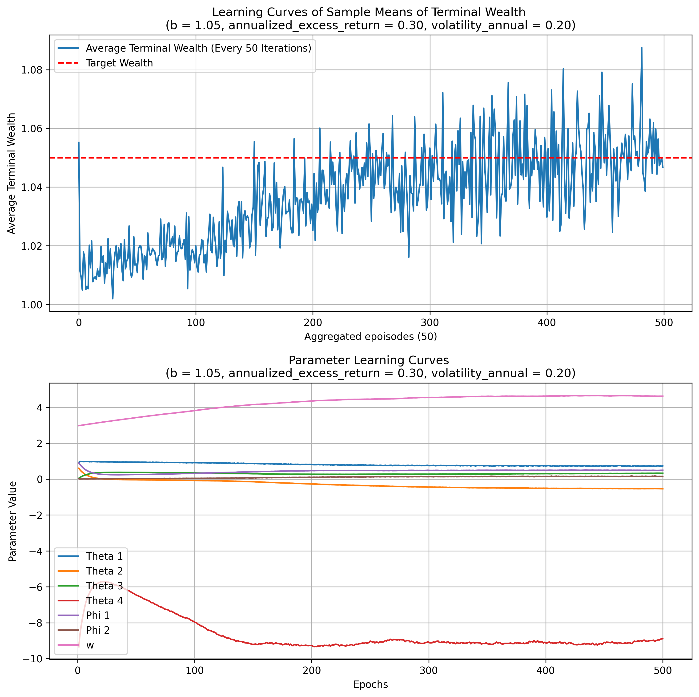
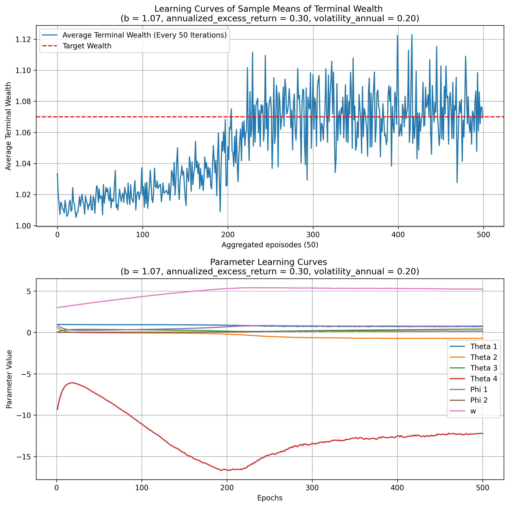
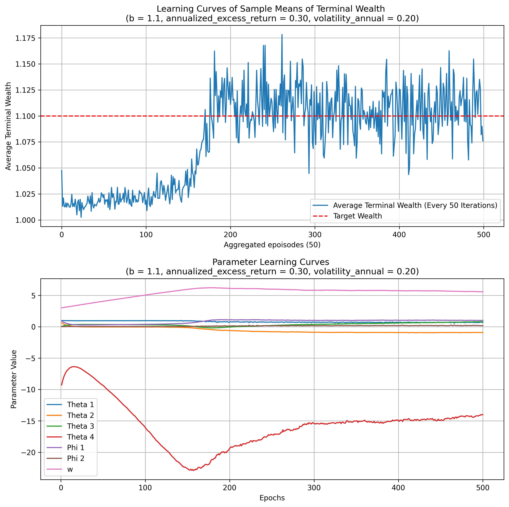
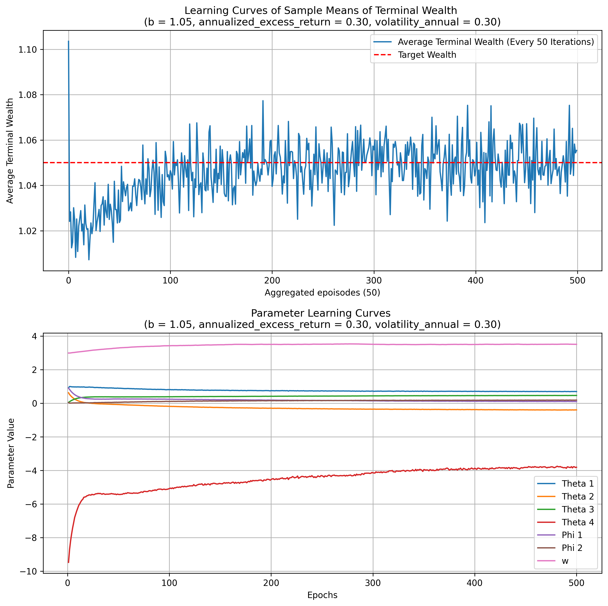
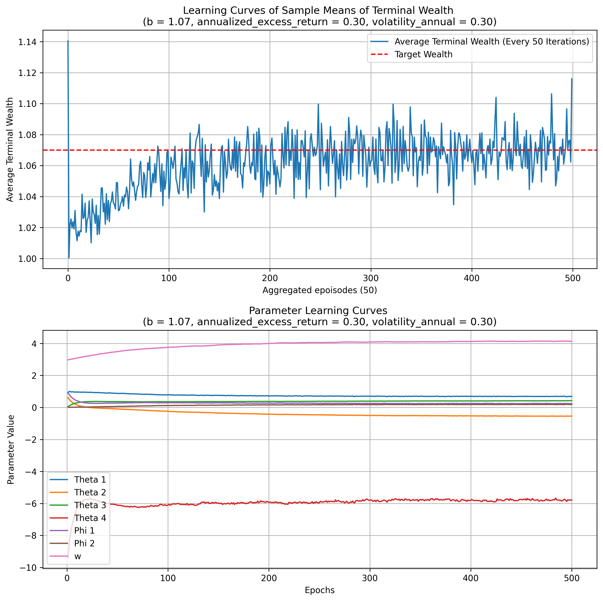
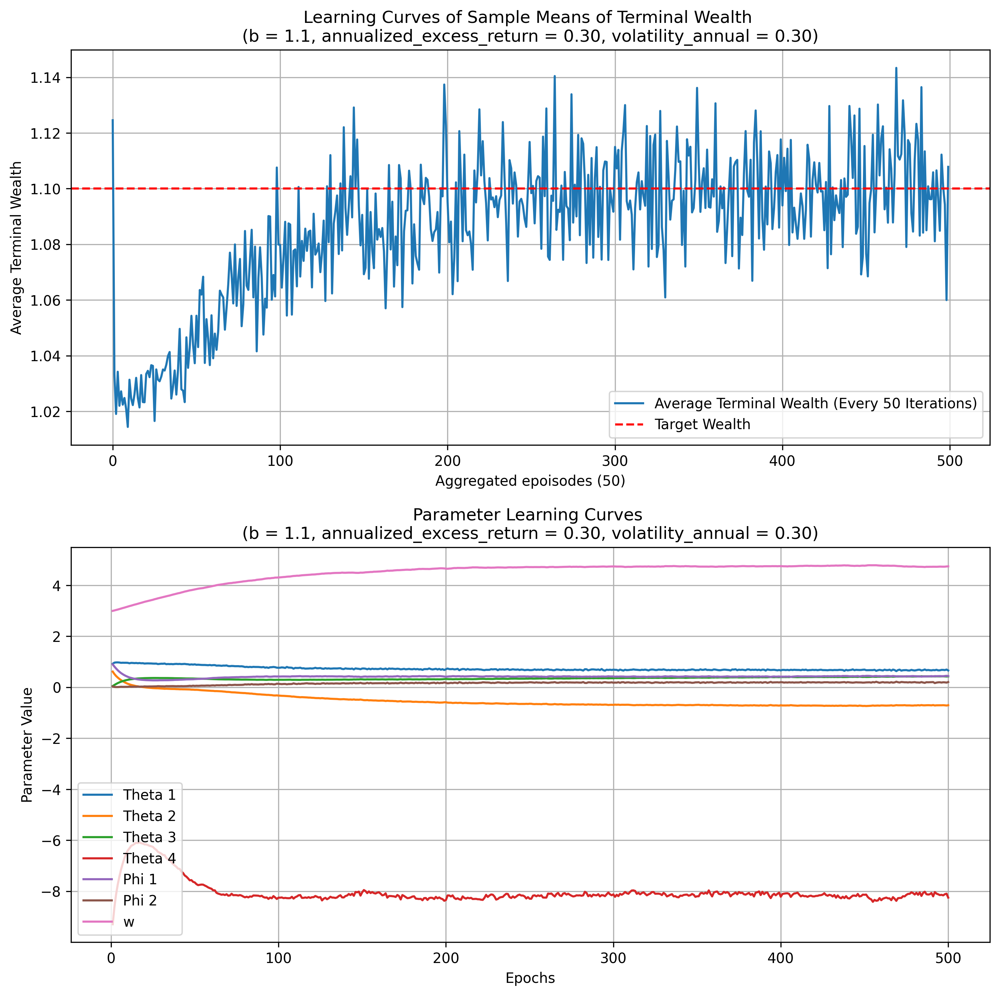

# Discrete-Time Mean-Variance Strategy Based on Reinforcement Learning

根据贝尔曼最优原则求解带熵正则的最优值函数，并给出相应的最优策略分布。后给定最初容许控制，证明策略评估后的策略迭代过程能够最终收敛到最优策略分布，并参数化值函数和策略分布，设计RL算法，根据历史金融数据进行学习并估计参数。
<!-- more -->

**Autor：** Xiangyu Cui, Xun Li, Yun Shi, Si Zhao

## 2 离散时间探索性的均值方差问题
* 2.1 经典离散时间均值方差问题
* 2.2 离散时间探索性的均值方差问题

### 2.1 经典离散时间均值方差问题

首先考虑由两个资产组成的市场：

* 无风险资产，回报率 $r_f$
* 风险资产，t到t+1的超额回报率 $r_t$，服从均值为 $a$，方差为 $\sigma^2$ 的正态分布。

**假设：** $r_t,t=0,1,\dots,T-1$  是统计上独立的

* 投资者进入市场的初始财富为 $x_0$
* 投资者希望在策略 $\mathbf{u} = \{u_0, u_1,\dots,u_{T-1} \}$ 下的最终财富期望值为 $x_T = b$

简单说，投资者将会面临以下的优化问题：

\begin{align*}
        \min\ &\operatorname{Var}(x_T^u), \\[2mm]
        \text{s.t. }&\mathbb{E}[x_T^u] = b,\\[2mm]
        &x_{t+1}= r_f x_t + r_t u_t,\quad\quad t = 0,1,\dots,T-1
\end{align*}

引入 Lagrange multiplier $w$，将问题转换为无约束条件问题。

\begin{equation}
    \min_u\ \mathbb{E}(x_T^u)^2-b^2-2w(\mathbb{E}[x_T^u]-b) = \min_u\ \mathbb{E}(x_T^u - w)^2 - (w-b)^2.
\end{equation}

该问题存在解析解 $\mathbf{u}^*=\{u_0^*,u_1^*,\dots,u_{T-1}^*\}$ 依赖于 $w$.
详细的推导可见 *(2000)Optimal dynamic portfolio selection: Multiperiod mean-variance formulation*

### 2.2 离散时间探索性的均值方差问题

在强化学习框架中，控制过程 $\mathbf{u} = \{u_t,0\le t <T\}$ 是随机化的，代表探索和学习，从而形成了以测度值或分布控制的过程，其密度函数表示为 $\boldsymbol{\pi} = \{\pi_t,0\le t < T\}$.
因此，财富的动态表示为：

\begin{equation}
    x_{t+1}^\pi = r_f x_t^\pi + r_t u_t^\pi.
\end{equation}

**假定：**

* 超额收益 $r_t$ 服从一个均值为 $a$ 和方差 $\sigma^2$ 的分布。
* $u_t^\pi$ 是一个随机控制过程，概率密度为 $\pi_t$。
* $r_t$ 与 $u_t^\pi$ 是独立的。

那么在周期 $t$ 处，$r_t u_t^\pi$ 的条件一阶矩和二阶矩可以表示为：

\begin{align*}
    &\mathbb{E}_t[r_tu_t^\pi] = \mathbb{E}_t[r_t]\mathbb{E}_t[u_t^\pi] = a\int_{\mathbb{R}}u\pi_t(u)du,\\
    &\mathbb{E}_t[(r_tu_t^\pi)^2]=\mathbb{E}_t[(r_t)^2]\mathbb{E}_t[(u_t^\pi)^2]=(a^2+\sigma^2)\int_{\mathbb{R}}u^2\pi_t(u)du.
\end{align*}

随机分布控制过程 $\boldsymbol{\pi} =\{\pi_t,0 \le t < T\}$ 用总体的累积熵去刻画的强化学习的探索过程。

\begin{equation*}
    \mathcal{H}(\boldsymbol{\pi}) := -\sum_{t=0}^{T-1}\int_{\mathbb{R}}\pi_t(u)\ln\pi_t(u)du.
\end{equation*}

在离散时间市场环境下，探索性MV问题的目标函数变为：

\begin{equation}
    V^\pi = \min_\pi \mathbb{E}\left[(x_T^\pi - w)^2 + \lambda \sum_{t=0}^{T-1}\int_{\mathbb{R}}\pi_t(u)\ln\pi_t(u)du\right] - (w-b)^2.
\end{equation}

??? 原先的目标函数

    \begin{equation*}
        \min_u\ \mathbb{E}(x_T^u - w)^2 - (w-b)^2.
    \end{equation*}

* $\lambda :$ temperature parameter measures the trade-off between exploitation and exploration in this MV problem.

问题(3)中理论的最优反馈控制和相应的最优值函数如下：

定义在策略 $\boldsymbol{\pi}$ 下的值函数 $J(t,x;w)$:

\begin{equation*}
    J(t,x;w) = \mathbb{E}\left[(x_T^\pi - w)^2 + \lambda \sum_{s=t}^{T-1}\int_{\mathbb{R}}\pi_s(u)\ln\pi_s(u)du \mid x_t^\pi = x \right] - (w-b)^2
\end{equation*}

$J^*(t,x;w)$ 称为问题(3)的最优值函数：

\begin{align*}
    &J^*(t,x;w) = \min_{\pi_{t}, \ldots, \pi_{T-1}}\mathbb{E}\left[(x_T^\pi - w)^2 + \lambda \sum_{s=t}^{T-1}\int_{\mathbb{R}}\pi_s(u)\ln\pi_s(u)du \mid x_t^\pi = x \right] - (w-b)^2,\\
    &J^*(T,x;w) = (x-w)^2 - (w-b)^2.
\end{align*}

***
**Theorem 1.** At period t, the optimal value function is given by

\begin{equation}
    \begin{split}
        &J^*(t,x;w) \\
        =&\left(\frac{\sigma^2 r_f^2}{a^2+\sigma^2}\right)^{T-t}(x-\rho_t w)^2 + \frac{\lambda}{2}(T-t)\ln\left(\frac{a^2 + \sigma^2}{\pi \lambda}\right) \\
        &+ \frac{\lambda}{2}\sum_{i=t+1}^{T}(T-i)\ln\left(\frac{\sigma^2 r_f^2}{a^2 + \sigma^2}\right) - (w-b)^2.
    \end{split}
\end{equation}

where $\rho_t = (r_f^{-1})^{T-t}$. Moreover, the optimal feedback control is Gaussian, with its density function given by

\begin{equation}
    \pi^*(u;t,x,w) = \mathcal{N}\left(u \,\Bigg| \, - \frac{ar_f(x-\rho_t w)}{a^2 + \sigma^2}, \frac{\lambda}{2(a^2 + \sigma^2)}\left( \frac{a^2 + \sigma^2}{\sigma^2 r_f^2} \right)^{T-t-1}\right) .
\end{equation}
***

[NOTE:超额收益 $r_t$ 服从一个均值为 $a$ 和方差 $\sigma^2$ 的分布。]

??? 定理1有两点需要注意
    1. 方差项衡量最优的高斯策略在 $t$ 时刻的的探索程度，意味着探索会随着时间衰减。agent 初始会最大程度的进行探索，然后探索程度会随时间逐渐衰减。
    随着时间接近到期日，利用会主导探索并且会变得越来越重要，这是因为有一个将对投资者的行动进行评估的 deadline T。
    2. 最优高斯策略的均值与探索权重 $\lambda$ 无关，方差与状态 $x$ 无关。完美的将**利用**和**探索**进行了分离，因为前者由均值捕捉，后者由方差捕捉。

## 3. 离散时间算法

上述内容证明并给出了离散时间探索性均值-方差问题的最优解。接下来设计对应的RL算法来
直接学习求解和输出投资组合分配策略。接下来要做的内容有两部分：

* 1.策略提升定理和策略收敛
* 2.一个自校正方案来学习真正的拉格朗日乘子 $w$ 

??? 注意
    该RL算法跳过了模型参数的估计，如超额回报 $r_t$ 的均值和方差，这些参数难以准确估计。

### 3.1 策略提升定理和策略收敛

??? 为什么需要策略提升定理和策略收敛
    策略方案可以向正确的方向更新当前策略，以改进 value function 。
    **策略提升定理**会保证迭代后的 value function 是非增的（在最小化的问题的情况下）。
    **策略收敛**保证会最终收敛到 optimal value function 。

以下给出的定理说明了，在固定 $w$ 和给定服从以下分布的最初的容许控制的情况下，最终策略会收敛到最优策略

***
**Theorem 2.** Suppose $w\in \mathbb{R}$ is fixed and $\boldsymbol{\pi}^0$ is an arbitrarily given admissible feedback
control policy, subjecting to

\[ 
\pi_t^0(u;x,w) = \mathcal{N}\left( u \mid K(x-\rho_t w), \lambda BC^{T-t-1} \right)
\]

Then we can calculate $J^{\pi^0}(t,x;w)$

\begin{align*}
    \text{where} &\\
    & \rho_t  = r_f^{-(T-t)} \\
    & A = r_f^2 + (a^2 + \sigma^2)K^2 + 2r_f a K \\
    & f(t) = \frac{\lambda B (a^2 + \sigma^2)[1-(CA)^{T-t}]}{1-CA} - \frac{\lambda}{2}\ln (2\pi \lambda B)(T-t) - \frac{\lambda}{2}(T-t)-\frac{\lambda}{2}\ln C\sum_{i=0}^{T-t-1}i-(w-b)^2 
\end{align*}

$f(t)$ is a smooth function that only depends on $t$

\begin{equation*}
    \begin{split}
        &J^{\pi^0}(t,x;w) \\
        = & A^{T-t}(x-\rho_t w)^2 + \frac{\lambda B (a^2 + \sigma^2)[1-(CA)^{T-t}]}{1-CA} - \frac{\lambda}{2}\ln (2\pi \lambda B)(T-t)\\
        & - \frac{\lambda}{2}(T-t)-\frac{\lambda}{2}\ln C\sum_{i=0}^{T-t-1}i-(w-b)^2 \\
        = & A^{T-t}(x-\rho_t w)^2 + f(t)
    \end{split}
\end{equation*}

Using the condition 
$\pi_{t}^{k+1}(u ; x, w)=\arg \min _{\pi_{t}^{k}(u)} J^{\pi^{k}}(t, x ; w)$
to update the feedback policy and making this iteration for k times, we can get 
$\pi_{t}^{k}(u ; x, w)$ 
and the corresponding value function
$J^{\pi^{k}}(t, x ; w):$

\begin{equation}
    \pi_{t}^{k}(u ; x, w)=\mathcal{N}\left(u \left\lvert\,-\frac{a r_{f}\left(x-\rho_{t} w\right)}{a^{2}+\sigma^{2}}\right., \frac{\lambda}{2\left(a^{2}+\sigma^{2}\right) A^{T-t-k}}\left(\frac{a^{2}+\sigma^{2}}{\sigma^{2} r_{f}^{2}}\right)^{k-1} \right),
\end{equation}

\begin{equation}
    \begin{split}
        & J^{\pi^k}(t,x;w) \\
        = & A^{T-t-k}\left(\frac{\sigma^{2} r_{f}^{2}}{a^{2}+\sigma^{2}}\right)^{k}\left(x-\rho_{t} w\right)^{2}+\frac{\lambda}{2} k \ln \left(\frac{a^{2}+\sigma^{2}}{\pi \lambda}\right) \\
        & + \frac{\lambda}{2} \sum_{i=0}^{k-1} i \ln \left(\frac{\sigma^{2} r_{f}^{2}}{a^{2}+\sigma^{2}}\right) + \frac{\lambda \ln A}{2} k(T-t-k)+f(t+k).
    \end{split}
\end{equation}
***

??? NOTE
    上述定理描述了以下迭代过程是合理的。即：
    
    &emsp; **策略评估：**给定当前策略 $\pi^k$ 计算其对应的值函数 $J^{\pi^k}$

    &emsp; **策略提升：**选择让 $J^{\pi^k}$ 最小化的策略分布：

    \[\pi_{t}^{k+1}(u ; x, w)=\arg \min _{\pi_{t}^{k}(u)} J^{\pi^{k}}(t, x ; w) \]
    
    该定理证明了，该迭代过程，能够使更新后的策略能够收敛到理论最优策略。

### 3.2 算法设计

设计RL算法去求解离散时间探索性投资组合选择问题。算法包含三个步骤：策略评估，策略提升和学习 Lagrange multiplier $w$ 的自校正方案。

#### Policy Evaluation

通过 Bellman equation 可以得到

\[ J^{\pi}(t, x ; w)=\mathbb{E}\left[J^{\pi}\left(t+1, x_{t+1} ; w\right)+\lambda \int_{\mathbb{R}} \pi_{t}(u) \ln \pi_{t}(u) d u \Bigg| x_{t}=x\right] \]

将方程进行重排，得到

\[\mathbb{E}\left[J^{\pi}\left(t+1, x_{t+1} ; w\right)-J^{\pi}\left(t, x_{t} ; w\right)+\lambda \int_{\mathbb{R}} \pi_{t}(u) \ln \pi_{t}(u) d u \Bigg| x_{t}=x\right]=0 \]

定义 Bellman's error

\[\delta_{t}=\hat{J}_{t}^{\pi}+\lambda \int_{\mathbb{R}} \pi_{t}(u) \ln \pi_{t}(u) d u \]

其中 $\hat{J}_{t}^{\pi}=J^{\pi}\left(t+1, x_{t+1} ; w\right)-J^{\pi}\left(t, x_{t} ; w\right)$.

策略评估的目标是要最小化贝尔曼误差 $\delta_t$. :question:

* $J^\theta$ 参数化的 value function，$\theta$ 需要学习的参数化向量
* $\pi^\phi$ 参数化的 policy，$\phi$ 需要学习的参数化向量

然后最小化 

\begin{align*}
    C(\theta, \phi) & =\frac{1}{2} \mathbb{E}\left[\sum_{i=0}^{T-1}\left|\delta_{i}\right|^{2}\right] \\
    & =\frac{1}{2} \mathbb{E}\left[\sum_{i=0}^{T-1}\left|J^{\theta}\left(i+1, x_{i+1} ; w\right)-J^{\theta}\left(i, x_{i} ; w\right)+\lambda \int_{\mathbb{R}} \pi_{i}^{\phi}(u) \ln \pi_{i}^{\phi}(u) d u\right|^{2}\right] \\
    & =\frac{1}{2} \mathbb{E}\left[\sum_{i=0}^{T-1}\left|\hat{J}_{i}^{\theta}+\lambda \int_{\mathbb{R}} \pi_{i}^{\phi}(u) \ln \pi_{i}^{\phi}(u) d u\right|^{2}\right]
\end{align*}

其中 $\pi^{\phi}=\left\{\pi_{t}^{\phi}, t=0,1, \ldots, T-1\right\}$. 

用以下方式收集样本 $D=\{(t,x_t),t=0,1,\dots,T \}$

$t=0$，初始样本 $(0,x_0)$

$t=0,1,\dots,T-1$，采样 $\pi_t^\phi$ 获得在风险资产的分配 $u_t$， 并且观察 $t+1$ 时刻的财富值 $x_{t+1}$

通过以下方式去近似 $C(\theta,\phi)$

\begin{align*}
    C(\theta, \phi) & =\frac{1}{2} \sum_{\left(t, x_{t}\right) \in D}\left[J^{\theta}\left(t+1, x_{t+1} ; w\right)-J^{\theta}\left(t, x_{t} ; w\right)+\lambda \int_{\mathbb{R}} \pi_{t}^{\phi}(u) \ln \pi_{t}^{\phi}(u) d u\right]^{2} \\
    & =\frac{1}{2} \sum_{\left(t, x_{t}\right) \in D}\left[\hat{J}^{\theta}\left(t, x_{t} ; w\right)+\lambda \int_{\mathbb{R}} \pi_{t}^{\phi}(u) \ln \pi_{t}^{\phi}(u) d u\right]^{2}
\end{align*}

根据先前求出的最优值函数，我们可以考虑将值函数参数化为：

\[J^{\theta}(t, x ; w)=\theta_{1}^{T-t}\left(x-\rho_{t} w\right)^{2}+\theta_{2} t^{2}+\theta_{3} t+\theta_{4}, \]

??? Recall optimal value function
    \begin{align*}
            &J^*(t,x;w) \\
            =&\left(\frac{\sigma^2 r_f^2}{a^2+\sigma^2}\right)^{T-t}(x-\rho_t w)^2 + \frac{\lambda}{2}(T-t)\ln\left(\frac{a^2 + \sigma^2}{\pi \lambda}\right) \\
            &+ \frac{\lambda}{2}\sum_{i=t+1}^{T}(T-i)\ln\left(\frac{\sigma^2 r_f^2}{a^2 + \sigma^2}\right) - (w-b)^2.
    \end{align*}

其中 $\rho_t = r_f^{-(T-t)}$ 和 $r_f$ 都是已知的。

#### Policy Improvement

从策略提升更新方案中，策略 $\pi_t^{\phi}(u)$ 的均值和方差分别是，$-\frac{a r_{f}\left(x-\rho_{t} w\right)}{a^{2}+\sigma^{2}}$ 和 $\frac{\lambda}{2\left(a^{2}+\sigma^{2}\right) \theta_{1}^{T-t-1}}$
由此，可以得到熵

\begin{align*}
    H\left(\pi_{t}^{\phi}\right) & =-\int_{\mathbb{R}} \pi_{t}^{\phi}(u) \ln \pi_{t}^{\phi}(u) d u \\
    & =\frac{1}{2} \ln \left(\frac{\pi e \lambda}{a^{2}+\sigma^{2}}\right)-\frac{\ln \theta_{1}}{2}(T-t-1)
\end{align*}

将其进行参数化，表示为 $H\left(\pi_{t}^{\phi}\right)=\phi_{1}+\phi_{2}(T-t-1)$ ，可以导出：

\[
\left\{\begin{array}{l}
    \phi_{1}=\frac{1}{2} \ln \left(\frac{\pi e \lambda}{a^{2}+\sigma^{2}}\right) \\
    \phi_{2}=-\frac{\ln \theta_{1}}{2} \\
    \theta_{1}=\frac{\sigma^{2} r_{f}^{2}}{a^{2}+\sigma^{2}}
    \end{array}\right.
\]

用 $\phi_1$ 和 $\phi_2$ 重新表示策略

\begin{align*}
    & \pi_{t}^{\phi}(u ; x, w) \\
    = & \mathcal{N}\left(u \left\lvert\,-\frac{a r_{f}\left(x-\rho_{t} w\right)}{a^{2}+\sigma^{2}}\right., \frac{\lambda}{2\left(a^{2}+\sigma^{2}\right) \theta_{1}^{T-t-1}}\right) \\
    = & \mathcal{N}\left(u \left\lvert\,-\sqrt{\frac{r_{f}^{2}-e^{-2 \phi_{2}}}{\lambda \pi}} e^{\frac{2 \phi_{1}-1}{2}}\left(x-\rho_{t} w\right)\right., \frac{1}{2 \pi} e^{2 \phi_{2}(T-t-1)+2 \phi_{1}-1}\right)
\end{align*}

利用上述得到的参数化形式的 $H\left(\pi_{t}^{\phi}\right)=\phi_{1}+\phi_{2}(T-t-1)$，重写 $C(\theta,\phi)$ 得到

\[C(\theta, \phi)=\frac{1}{2} \sum_{\left(t, x_{t}\right) \in D}\left[\hat{J}^{\theta}\left(t, x_{t} ; w\right)-\lambda\left(\phi_{1}+\phi_{2}(T-t-1)\right)\right]^{2} \]

该论文采用随机梯度下降（SGD）的方式去更新参数 $(\phi_1,\phi_2)'$ 和 $(\theta_2,\theta_3)'$

\begin{align*}
    \textbf{Note that:} & \\
    & \hat{J}^{\theta}\left(t, x_{t} ; w\right)=J^{\theta}\left(t+1, x_{t+1} ; w\right)-J^{\theta}\left(t, x_{t} ; w\right) \\
    & J^{\theta}\left(t, x_{t} ; w\right)\ 中的参数\ \theta_{1}=e^{-2 \phi_{2}}  &
\end{align*}

\begin{equation}
    \frac{\partial C}{\partial \theta_{2}}=\sum_{\left(t, x_{t}\right) \in D}\left[\hat{J}^{\theta}\left(t, x_{t} ; w\right)-\lambda\left(\phi_{1}+\phi_{2}(T-t-1)\right)\right]\left((t+1)^{2}-t^{2}\right),
\end{equation}

\begin{equation}
    \frac{\partial C}{\partial \theta_{3}}=\sum_{\left(t, x_{t}\right) \in D}\left[\hat{J}^{\theta}\left(t, x_{t} ; w\right)-\lambda\left(\phi_{1}+\phi_{2}(T-t-1)\right)\right],
\end{equation}

\begin{equation}
    \frac{\partial C}{\partial \phi_{1}}=-\lambda \sum_{\left(t, x_{t}\right) \in D}\left[\hat{J}^{\theta}\left(t, x_{t} ; w\right)-\lambda\left(\phi_{1}+\phi_{2}(T-t-1)\right)\right],
\end{equation}

\begin{equation}
    \begin{split}
        \frac{\partial C}{\partial \phi_{2}}= &\sum_{\left(t, x_{t}\right) \in D}\left[\hat{J}^{\theta}\left(t, x_{t} ; w\right)-\lambda\left(\phi_{1}+\phi_{2}(T-t-1)\right)\right] \times \\
        & \left[2(T-t) e^{-2 \phi_{2}(T-t)}\left(x_{t}-\rho_{t} w\right)^{2}\right. \\
        & \left.-2(T-t-1) e^{-2 \phi_{2}(T-t-1)}\left(x_{t+1}-\rho_{t+1} w\right)^{2}-\lambda(T-t-1)\right].
    \end{split}
\end{equation}

$\theta_1$ 根据 $\theta_1 = e^{-2\phi_2}$，$\theta_4$ 则根据终值条件进行更新

\begin{align*}
    J^{\theta}(T, x ; w) &=\left(x- w\right)^{2}+\theta_{2} T^{2}+\theta_{3} T+\theta_{4} \\
    & =(x-w)^{2}-(w-b)^{2}
\end{align*}

换句话说 $(\theta_1,\theta_4)$ 的更新方案如下：

* $\theta_1 = e^{-2\phi_2}$ 
* $\theta_{4}=-\theta_{2} T^{2}-\theta_{3} T-(w-b)^{2}$ 

#### Self-correcting Scheme

\[w_{n+1}=w_{n}-\alpha\left(x_{T}-b\right)\]

其中 $\alpha$ 是拉格朗日乘子自校正的学习率。

在实现过程中，将 $x_T$ 替换为样本均值 $\frac{1}{N} \sum_{j} x_{T}^{j}$

* $N$ 是样本大小
* $\left\{x_{T}^{j}\right\}$ 是 $w$ 更新后获得的最近 $N$ 个的终值财富值

## 4.伪代码

<figure markdown="span">
  { width=auto }
</figure>

??? tip

    强化学习的目标是通过找到一个最优策略，最大化累积奖励。通常有两类方法：

    1.  **基于值函数的方法**（价值迭代、策略迭代）：通过学习状态值函数 $V^\pi(s)$，反过来从值函数推导出最优策略。
    2.  **基于策略的方法**（策略梯度）：直接优化策略，不依赖显示的值函数。

    **1.策略迭代的进本框架**

    :   **策略评估：**给定当前策略 $\pi^k$，计算其对应的值函数 $V^{\pi^k}(s)$
    :   **策略改进：**根据值函数，更新策略 $\pi^{k+1}$，例如选择让 $V^{\pi^k}(s)$ 最大化的策略分布：

    \[\pi^{k+1}(s) = \arg\max_{\pi^k} V^{\pi^k}(s) \]

    :   **迭代：**重复以上步骤，直到策略收敛

## 5.Result

论文复现代码过程，查阅[此处]

论文复现实验结果如下：

  [此处]: ../../../代码复现/1.基于强化学习的离散时间均值方差策略/code.md

| Target wealth b   | a = 30%, sigma = 20%                     |
| ----------------- | ---------------------------------------- |
| b = 1.1           | mean = 0.1078, std = 0.1661, SR = 0.6488 |
| b = 1.07          | mean = 0.0717, std = 0.1144, SR = 0.6263 |
| b = 1.05          | mean = 0.0522, std = 0.0764, SR = 0.6833 |

| Target wealth b   | a = 30%, sigma = 30%                     |
| ----------------- | ---------------------------------------- |
| b = 1.1           | mean = 0.1033, std = 0.1201, SR = 0.8604 |
| b = 1.07          | mean = 0.0710, std = 0.0921, SR = 0.7707 |
| b = 1.05          | mean = 0.0502, std = 0.0665, SR = 0.7546 |

<figure markdown="span">
  { width=auto }
</figure>
<figure markdown="span">
  { width=auto }
</figure>
<figure markdown="span">
  { width=auto }
</figure>
<figure markdown="span">
  { width=auto }
</figure>
<figure markdown="span">
  { width=auto }
</figure>
<figure markdown="span">
  { width=auto }
</figure>

